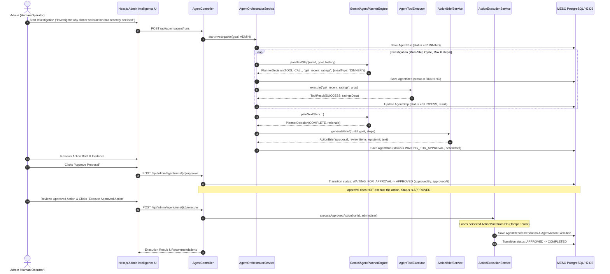

# MESO AI Operations Agent — End-to-End QA, Security & Verification Report

**Phase:** Phase 7 Final QA & Hardening  
**Status:** PASS  
**Timestamp:** 2026-10-03  

---

## 1. Executive Summary

This document certifies that the **MESO AI Operations Agent** has completed end-to-end verification, regression testing, security auditing, and production build checks across both backend and frontend layers.

All core invariants have been rigorously verified:
1. **Approval Binding & Server-Side Integrity:** Execution strictly enforces `status == APPROVED` and resolves the execution payload purely from the persisted `ActionBrief`. The client cannot alter the action payload or target.
2. **Epistemic Humility:** The Agent expresses evidence, observations, and possible contributing factors without claiming causal certainty.
3. **Operational Data Protection:** Production mess tables (`daily_menu`, `foods`, `food_reviews`, `complaints`, `food_polls`, `users`) remain strictly untouched by Agent execution.
4. **Idempotency & Concurrency Safety:** Duplicate execution calls cannot create duplicate recommendation or execution records. Database unique constraints and transactional locking prevent race conditions.
5. **No Regressions on Foundation:** The pre-existing **WHY** (Root Cause), **WHAT NEXT** (Forecast), and **WHAT IF** (Simulation) engines operate identically with zero modified calculations or schemas.

---

## 2. Golden Scenario End-to-End Trace

**Goal:** *"Investigate why dinner satisfaction has recently declined"*

---

## 3. Safety, Security & Epistemic Boundaries

### 3.1 Strict State Machine Transitions

| Current State | Permitted Next States | Enforced Behavior |
| :--- | :--- | :--- |
| `PENDING` | `RUNNING`, `FAILED` | Initialization |
| `RUNNING` | `WAITING_FOR_APPROVAL`, `FAILED`, `CANCELLED` | Investigation loop termination |
| `WAITING_FOR_APPROVAL` | `APPROVED`, `CANCELLED` | Human approval or rejection |
| `APPROVED` | `COMPLETED`, `FAILED` | Controlled execution only |
| `COMPLETED` | *Terminal* | Immutable |
| `FAILED` | *Terminal* | Immutable |
| `CANCELLED` | *Terminal* | Immutable |

### 3.2 Tool Security
- **Read-Only Data Tools:**
  - `get_recent_ratings`: Filtered to numeric aggregates and anonymized feedback.
  - `get_complaints`: Read-only, PII-sanitized complaint logs.
  - `get_menu_history`: Read-only historical meal definitions.
  - `get_poll_results`: Read-only active/completed poll stats.
- **AI Engine Adapters:**
  - `run_root_cause`: Executes `RootCauseEngine` in non-mutating analysis mode.
  - `run_prediction`: Executes `ForecastEngine` in read-only projection mode.
  - `run_simulation`: Executes `SimulationEngine` in read-only sandbox mode.
- **Action Tools Blocked during Investigation:**
  - `update_menu`, `adjust_procurement`, `create_survey` are intercepted and rejected with `ACTION_EXECUTION_BLOCKED` error if attempted during the planning phase.
  - Unknown tools return `UNKNOWN_TOOL` errors without invoking system processes.

### 3.3 Epistemic Humility Standards
- All recommendations use cautious epistemic terms:
  - `"Possible Contributing Factors"` (never "Root Causes").
  - `"What Stood Out"` (evidence and observations).
  - `"Confidence"` metrics clearly declared.
  - Recommendations are contextualized as operational proposals for human review.

---

## 4. Test Execution & Build Verification

### 4.1 Backend Test Execution
- **Command:** `mvn test`
- **Results:**
  - **Tests run:** 182
  - **Failures:** 0
  - **Errors:** 0
  - **Skipped:** 0
- **Dedicated Comprehensive QA Suite:** [`com.messo.agent.qa.AgentComprehensiveQaTest`](file:///d:/Github/Messo/src/test/java/com/messo/agent/qa/AgentComprehensiveQaTest.java)
  - Golden scenario 22-step flow verified.
  - Rigid state transition rejection matrix verified.
  - Tamper-proofing of server-side ActionBrief resolution verified.
  - Idempotency & concurrent double-execution locking verified.
  - Rejection transition (`WAITING_FOR_APPROVAL` -> `CANCELLED`) verified.
  - Execution failure rollback verified.
- **Packaging:** `mvn package -DskipTests` completed cleanly (`messo-0.0.1-SNAPSHOT.jar`).

### 4.2 Frontend Verification
- **Command:** `npm run typecheck --prefix frontend` -> **0 errors**
- **Command:** `npm run lint --prefix frontend` -> **0 warnings, 0 errors**
- **Command:** `npm run build --prefix frontend` -> **Success (Exit code 0)**
  - All 20 routes generated successfully.
  - Route `/admin/intelligence`: 26 kB (113 kB First Load JS).

---

## 5. Operational Integrity

Verification confirms that no Agent execution has mutated or degraded:
- `daily_menu`
- `foods`
- `food_reviews`
- `complaints`
- `food_polls`
- `users`

Only `agent_runs`, `agent_steps`, `agent_action_executions`, and `agent_recommendations` are populated during operations.
